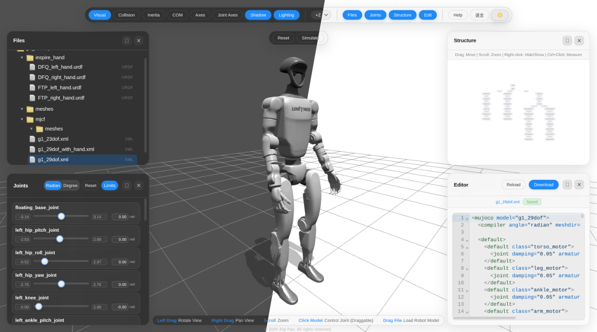

# URDF End-Effector Editor

[中文](./README.md)

A lightweight Web URDF end-effector editor for trimming robot end-effector subtrees, adding fixed/TCP links, and exporting modified URDF files.

This project is built on top of [fan-ziqi/robot_viewer](https://github.com/fan-ziqi/robot_viewer), preserving the upstream Apache-2.0 license and attribution. The current focus is stable URDF + meshes import, visualization, and end-effector chain editing.

## Features

- Drag and drop a complete URDF description folder, for example `g1_d_description/`.
- Automatically load `.urdf` files and sibling `meshes/` assets.
- Resolve common mesh path forms:
  - `meshes/xxx.STL`
  - `./meshes/xxx.STL`
  - `../meshes/xxx.STL`
  - `package://xxx/meshes/xxx.STL`
- Load robot models according to the URDF link / joint tree.
- Render `visual` geometry by default and parse `collision` geometry.
- Support `fixed`, `revolute`, `continuous`, and `prismatic` joints.
- Use URDF / ROS coordinate semantics:
  - `+Z` up
  - `+X` forward
  - `+Y` left
- Select links from the 3D viewport and synchronize selection with the structure tree.
- Inspect selected link information:
  - parent joint
  - child joints
  - descendant count
  - descendant list
- End-effector subtree operations:
  - Preview descendants
  - Hide descendants
  - Restore hidden
  - Trim after this link
- Add fixed child links.
- Add `tcp_link`.
- Edit origin through Direct pose or Guided pose.
- Export the modified URDF.

## End-Effector Editing Workflow

Typical workflow:

1. Drag in a robot URDF description folder.
2. Select a wrist / mount link in the 3D view or structure tree.
3. Open the `End Effector` panel.
4. Inspect the selected link, parent joint, child joints, and descendants.
5. Use `Preview descendants` to check the affected downstream links.
6. Use `Hide descendants` / `Restore hidden` for temporary visualization.
7. Use `Trim after this link` to remove all descendants downstream of the selected link.
8. Use `Add child link` to add a new fixed link.
9. Use `Add tcp_link` to add a TCP.
10. Export the modified URDF.

## Trim after this link

`Trim after this link` is a safe end-effector chain trimming operation:

- Keeps the current selected link.
- Deletes all descendant links downstream of the selected link.
- Deletes joints connecting those descendants.
- Does not delete the selected link itself.
- Is disabled for the root link.
- Requires a second confirmation before execution.

This operation modifies the URDF XML.

## Add child link

`Add child link` adds a new fixed joint and child link under the selected link.

The first version only supports fixed joints. It does not add visual/collision geometry and does not write any editor-only helpers.

Inputs:

- joint name
- child link name
- origin xyz, in meters
- origin rpy, in radians

After adding, the editor will:

- update the internal URDF XML;
- reload the model;
- automatically select the newly added child link;
- allow adding another fixed joint/link segment.

## Add TCP link

`Add tcp_link` adds a fixed joint and `tcp_link` under the selected link.

It uses the same origin input interaction as `Add child link`. It does not currently create TCP visual helpers or visual/collision geometry.

## Origin Input Modes

Both Add child link and Add TCP link support two input modes.

### Direct pose

Directly edit the real URDF `<origin>` values:

- `xyz` is in meters;
- `rpy` is in radians;
- each field must contain three numbers.

### Guided pose

Use buttons to update the same Direct pose text values:

- translation distance is in mm;
- rotation angle is in deg;
- `+X` means `xyz.x += distance_m`;
- `-X` means `xyz.x -= distance_m`;
- `+Y` / `-Y` / `+Z` / `-Z` follow the same rule;
- `+Roll` means `rpy.roll += angle_rad`;
- `+Pitch` means `rpy.pitch += angle_rad`;
- `+Yaw` means `rpy.yaw += angle_rad`.

The first Guided pose version is based on parent link frame / URDF origin semantics only. It does not provide local/world frame switching or 3D drag editing.

## Local Development

Install dependencies:

```bash
pnpm install
```

Start the development server:

```bash
pnpm run dev --host 127.0.0.1 --port 5173
```

Open:

```text
http://127.0.0.1:5173/
```

Build for production:

```bash
pnpm run build
```

The build output is written to `dist/`.

## Suggested Local Tests

Basic regression:

1. Drag in a complete `g1_d_description/` folder.
2. Confirm that `g1_d.urdf` and sibling `meshes/` are detected.
3. Confirm the robot model renders correctly.
4. Confirm Z-up / X-forward / Y-left semantics.
5. Confirm rotation, zoom, pan, and view switching.

End-effector editing regression:

1. Select a wrist / mount link.
2. Inspect link / joint / descendant information in the End Effector panel.
3. Click `Preview descendants`.
4. Click `Hide descendants`, then `Restore hidden`.
5. Click `Trim after this link` and confirm the first click only enters confirmation mode.
6. Confirm again and verify that the selected link remains while downstream descendants are removed.
7. Use `Add child link` to add a fixed joint/link segment.
8. Switch to Guided pose, enter `80 mm`, click `+X`, and verify Direct xyz becomes `0.08 0 0`.
9. Enter `90 deg`, click `+Yaw`, and verify the third Direct rpy value is about `1.570796`.
10. Add two fixed joint/link segments in sequence.
11. Add `tcp_link`.
12. Export the URDF and re-import it to verify the structure.

## Current Limitations

- Deleting the selected link itself is not supported.
- Deleting a single joint is not supported.
- Reconnecting a tree after deleting an intermediate node is not supported.
- Context menus are not implemented.
- TransformControls are not implemented.
- 3D drag editing for origin is not implemented.
- Suction / gripper templates are not implemented yet.
- TCP axis visualization is not implemented yet.
- Editor-only visual helpers are not written to exported URDF.
- Complex URDF tags such as transmissions, gazebo extensions, plugins, and sensors are preserved where possible, but are not structured editor-owned data yet.

## Tech Stack

- Vite
- Three.js
- urdf-loader
- xacro-parser
- CodeMirror
- D3

The project still keeps upstream Robot Viewer features such as MJCF, USD, and MuJoCo support, but the current product direction is URDF + meshes import, end-effector editing, and URDF export.

## Upstream and Acknowledgements

This project is based on [fan-ziqi/robot_viewer](https://github.com/fan-ziqi/robot_viewer). Thanks to the original author and related open-source projects:

- [urdf-loader](https://github.com/gkjohnson/urdf-loaders)
- [xacro-parser](https://github.com/gkjohnson/xacro-parser)
- [mujoco_wasm](https://github.com/zalo/mujoco_wasm)
- [usd-viewer](https://github.com/needle-tools/usd-viewer)
- [mechaverse](https://github.com/jurmy24/mechaverse)

## License

This project keeps the upstream Apache License 2.0. See [LICENSE](./LICENSE).
